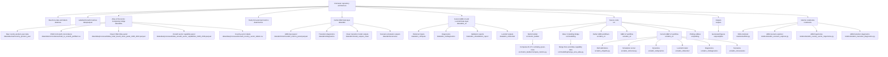

# Remaster Repository Organigram

This organigram focuses on the parts of the repository used in the active modelling workflow.

```mermaid
flowchart TD
    N1["Remaster repository architecture\n."]
    N2["Raw Eora data and labels\ndata/raw"]
    N1 --> N2
    N3["Labelled Eora26 matrices\ndata/parquet"]
    N1 --> N3
    N4["Atlas of Economic Complexity bridge\ndata/atlas"]
    N1 --> N4
    N5["Raw country-product-year data\ndata/atlas/raw/country_product_year"]
    N4 --> N5
    N6["HS92 to Eora26 concordance\ndata/atlas/concordance/hs92_to_eora26_prefilled.csv"]
    N4 --> N6
    N7["Clean HS92 Atlas panel\ndata/atlas/processed/atlas_hs92_level4_clean_panel_1995_2016.parquet"]
    N4 --> N7
    N8["Eora26 sector capability panel\ndata/atlas/processed/atlas_eora26_sector_capabilities_1995_2016.parquet"]
    N4 --> N8
    N9["Country-sector labels\ndata/atlas/processed/eora26_country_sector_labels.csv"]
    N4 --> N9
    N10["Yearly Eora-derived metrics\ndata/metrics"]
    N1 --> N10
    N11["Earlier ABM data layer\ndata/abm"]
    N1 --> N11
    N12["ABM input panel\ndata/abm/metrics/abm_metrics_panel.parquet"]
    N11 --> N12
    N13["Transition diagnostics\ndata/abm/diagnostics"]
    N11 --> N13
    N14["Clean transition model outputs\ndata/abm/model_outputs_clean"]
    N11 --> N14
    N15["Scenario simulation outputs\ndata/abm/scenarios"]
    N11 --> N15
    N16["Current ABM v3 and Leontief data layer\ndata/abm_v3"]
    N1 --> N16
    N17["Historical inputs\ndata/abm_v3/inputs"]
    N16 --> N17
    N18["Diagnostics\ndata/abm_v3/diagnostics"]
    N16 --> N18
    N19["Validation reports\ndata/abm_v3/validation_report"]
    N16 --> N19
    N20["Leontief outputs\ndata/abm_v3/leontief"]
    N16 --> N20
    N21["Source code\nsrc"]
    N1 --> N21
    N22["Metric builder\nsrc/metric_builder"]
    N21 --> N22
    N23["Computes EI, ET, centrality, green-ness\nsrc/metric_builder/compute_metrics.py"]
    N22 --> N23
    N24["Atlas / modelling bridge\nsrc/modelling"]
    N21 --> N24
    N25["Merge Eora and Atlas capability data\nsrc/modelling/merge_eora_atlas.py"]
    N24 --> N25
    N26["Earlier ABM workflows\nsrc/abm_v1"]
    N21 --> N26
    N27["ABM v2 workflow\nsrc/abm_v2"]
    N21 --> N27
    N28["Current ABM v3 workflow\nsrc/abm_v3"]
    N21 --> N28
    N29["Path definitions\nsrc/abm_v3/paths.py"]
    N28 --> N29
    N30["Simulation runner\nsrc/abm_v3/runner.py"]
    N28 --> N30
    N31["Dynamics\nsrc/abm_v3/dynamics"]
    N28 --> N31
    N32["Leontief model\nsrc/abm_v3/leontief"]
    N28 --> N32
    N33["Diagnostics\nsrc/abm_v3/diagnostics"]
    N28 --> N33
    N34["Scenarios\nsrc/abm_v3/scenarios"]
    N28 --> N34
    N35["Plotting utilities\nsrc/plotting"]
    N21 --> N35
    N36["Outputs\noutputs"]
    N1 --> N36
    N37["Generated figures\noutputs/plots"]
    N36 --> N37
    N38["Marimo notebooks\nnotebooks"]
    N1 --> N38
    N39["EDA notebook\nnotebooks/EDA.py"]
    N38 --> N39
    N40["ABM scenario explorer\nnotebooks/abm_scenario_explorer.py"]
    N38 --> N40
    N41["ABM trajectories\nnotebooks/abm_country_sector_trajectories.py"]
    N38 --> N41
    N42["ABM transition diagnostics\nnotebooks/abm_transition_diagnostics.py"]
    N38 --> N42
```
